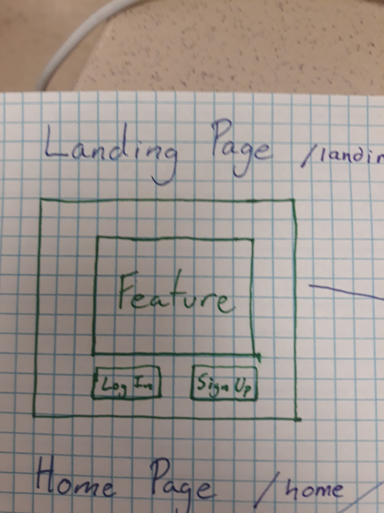
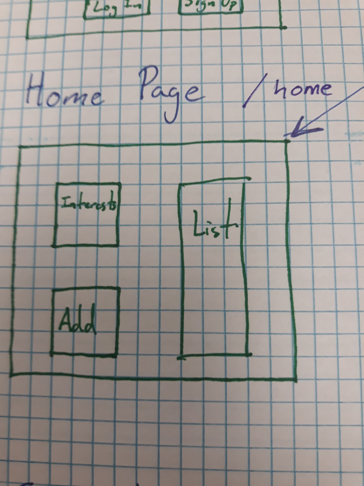
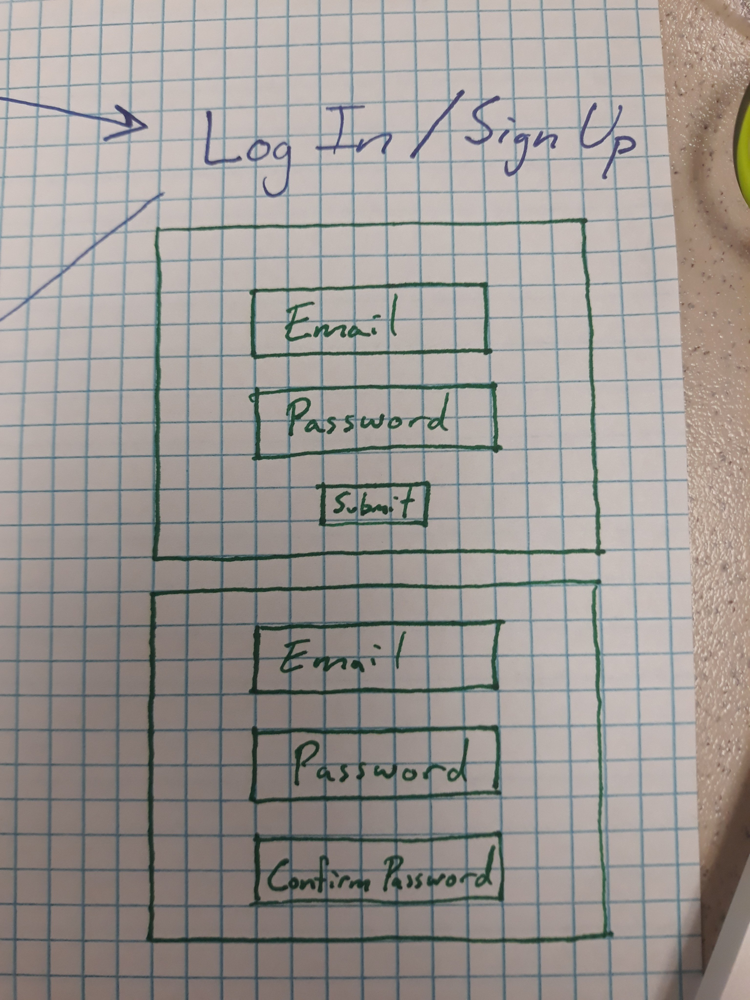
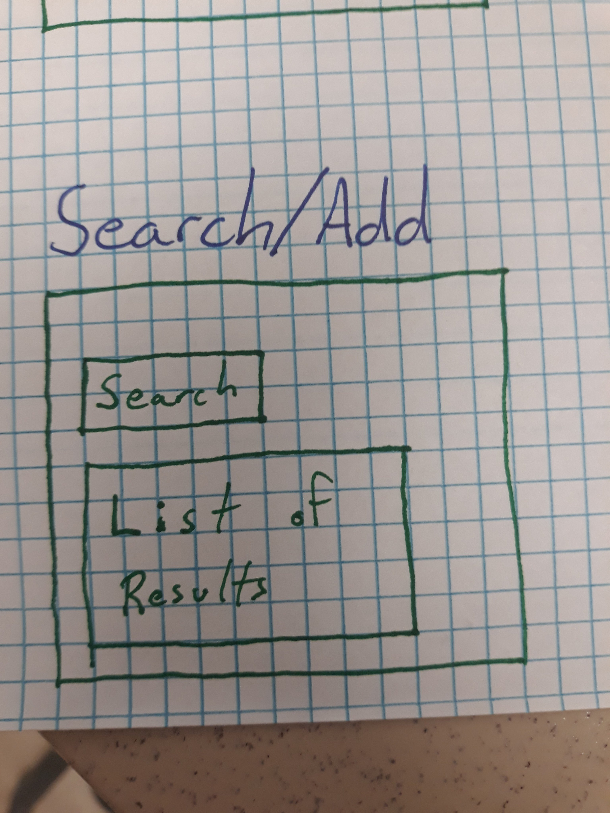
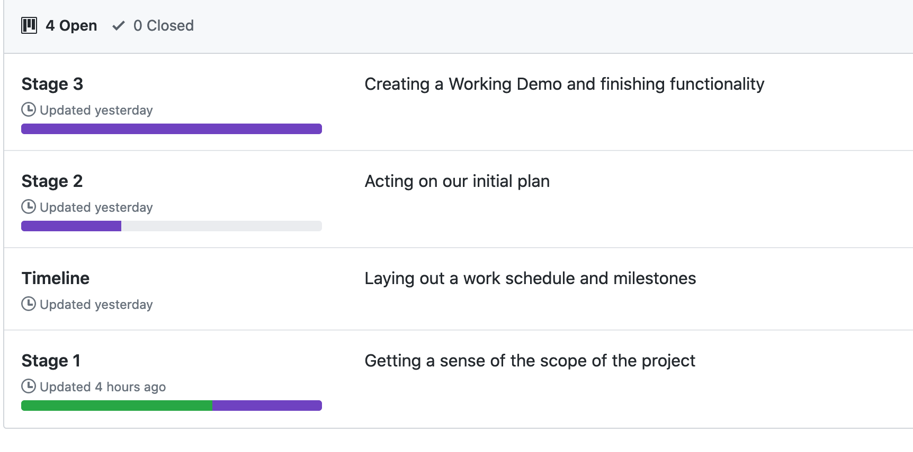

# Book Wyrm
### A database for Book Lovers

# link:

[Hosted by Heroku](https://book-wyrm.herokuapp.com/)

## User Story

* As someone who enjoys reading books, I want to search for new books, so that I can find new stuff to read.
* As someone who likes books, I want to see information about different books, so i can pick the ones I like.
* As a person who enjoys reading, I want to keep a running list of books, so that I always have something to read. 

## Business Context

A consumer will purchase books more often when they have an easy way to find and keep a list of the ones that are relevant to them.

Notable features:
- Allows the user to search for books that match their tastes using the OpenLibrary API
- Keeps a list of books the user is interested in that they can return to.
- Creates links to purchasable versions of preferred books.

Notable Advantages:
- Lighter-weight than competitors
- Has a narrower(and thus more focused) scope than Amazon and Goodreads.
- Easily exapnadable to include Social Media features.

## Operation

When the user loads the page, they are given the option to create a new User or continue with their previous profile.

The user is then able to:

  * Add books to a reading list.

  * Search for new books from a database

## Wireframes

### Note that all Pages will have a navbar and a footer.

### Landing Page
- Has once central feature div with a picture and a caption.
- Two buttons that allow you to either log-in or sign-up

<!-- *************************************** -->

### Home Page
- Displays a list of books the user has saved (blank by default)
- Has an assortment of interests that the user can mark their interest in.
- Button for user to Add a book to their list (progesses to Search/Add)

<!-- *************************************** -->

### Log-in/Sign-up
Displays one of two divs to the user:
- Create an Email & Password (& confirm password) form to sign up
- Submit an email and password to log-in

<!-- *************************************** -->

### Search and Add Page
- Has a search field for the user to search for books by name/author/genre/etc
- Displays the names of and information for the search results.

## Dev Team

#### Jake
- APIs
- DB Management

#### Kimi
- APIs
- DB Management

#### Mags
- OAUTH
- Presentation

#### Z
- Frontend
- Project Management

## Dev Schedule

#### Stage 1: Getting a sense of the scope of the project
Deadline: 02/26
#### Stage 2: Acting on our initial plan
Deadline: 02/29
#### Stage 3: Creating a Working Demo and refining functionality
Deadline: 03/03
#### Stage 4: Bug Fixes and Ice box
Deadline: 03/06

#### Working Plan on Github

[Github Project Link](https://github.com/N0matic/book-wyrm/projects)

<!-- ## Pseudocode
## Screenshots: -->

<!-- 
(https://github.com/N0matic/PumpUptheJAMS/blob/master/public/images/main.png)

(https://github.com/N0matic/PumpUptheJAMS/blob/master/public/images/add_exercise.png) -->
